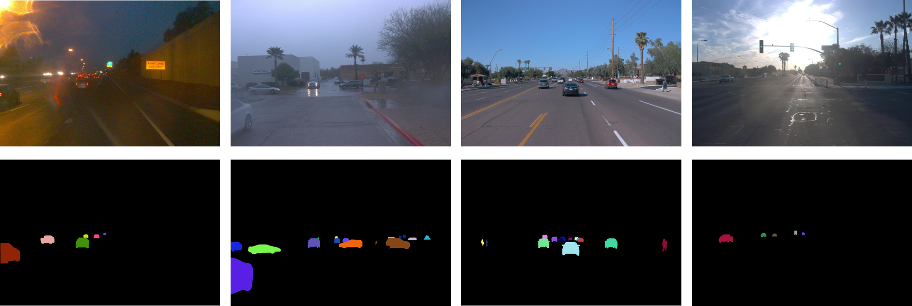
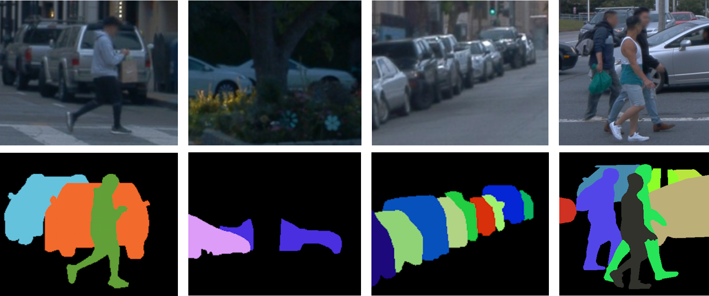

# Object-Affinity
Object Affinity Learning: Towards Annotation-free Instance Segmentation

# Introduction
We address the problem of annotation-free instance segmentation in the wild, aiming to relieve the expensive cost of manual mask annotations. Existing approaches utilize appearance cues, such as color, edge, and texture information, to generate pseudo masks for instance segmentation. However, due to the ambiguity of defining an object by visual appearance alone, these methods fail to distinguish objects from the background under complex scenes. Beyond visual cues, objects are one-piece in space and move together over time, which indicates that geometry cues, such as spatial continuity and motion consistency, are also exploitable for this problem. To directly utilize geometry cues, we propose an affinity-based paradigm for annotation-free instance segmentation. The new paradigm is called object affinity learning , a proxy task of annotation-free instance segmentation, which aims to tell whether two pixels come from the same object by learning feature representation from geometry cues. During inference, the learned object affinity could be further converted into instance segmentation masks by some graph partition algorithms.

# Installation
- [Dataset](docs/WIS.md)

# Waymo Instance Segmentation (WIS) Benchmark





# Bibtex
If this work is helpful for your research, please consider citing the following BibTeX entry.

```
@article{wang2023object,
  title={Object Affinity Learning: Towards Annotation-Free Instance Segmentation},
  author={Wang, Yuqi and Chen, Yuntao and Zhang, Zhaoxiang},
  journal={IEEE Transactions on Pattern Analysis and Machine Intelligence},
  year={2023},
  publisher={IEEE}
}
```

# Acknowledgement 
Many thanks to the following open-source projects:
* [dynamic-video-depth](https://github.com/google/dynamic-video-depth)
* [mmdetection](https://github.com/open-mmlab/mmdetection)